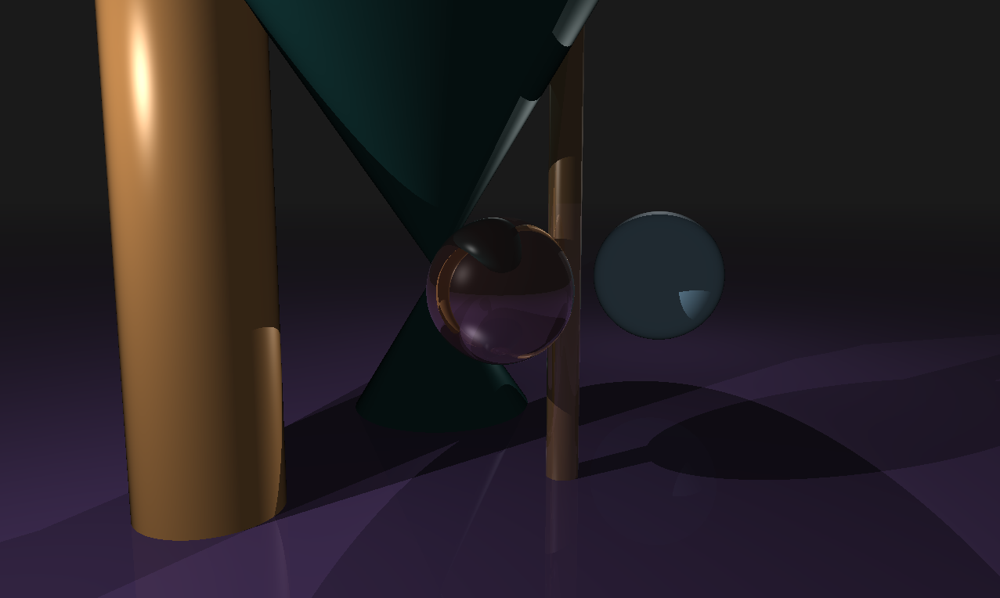
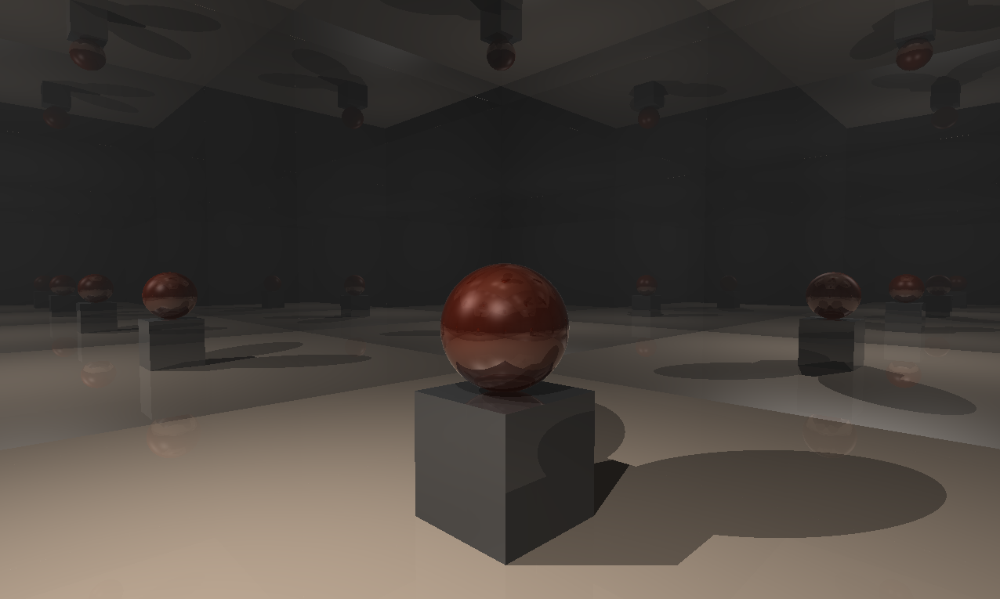
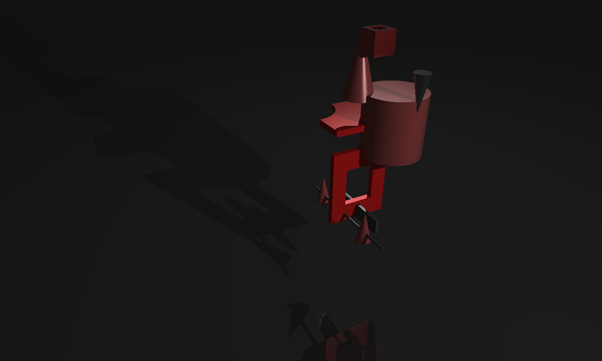
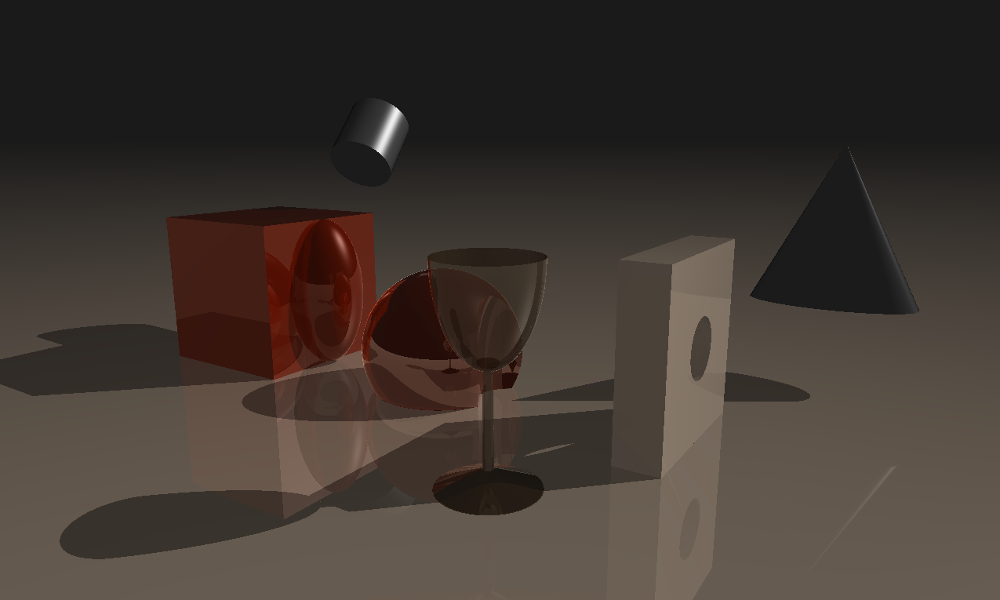

# 42-RT: Ray Tracing engine from scratch

## 1. Overview
The project implements a Ray Tracing engine from scratch in C and OpenCL for rendering volumetric figures.
The engine supports the following features:
- **5 simple figures**: `plane`, `sphere`, `cylinder`, `[capped] cone`, `box` + **1 complex figure**: `wineglass`;
- **4 operations** that can be applied to simple objects to construct complex ones: `union`, `intersection`, `difference`, `clipping`;
- **4 light source types**: `ambient`, `point`, `parallel`, `spot`;
- Reflective and transparent materials;
- Camera movement in 3 dimensions with variable FOV;

&nbsp;

## 2. Compilation
Requires SDL2, OpenCL

**Linux**: SDL2 headers should be located in /usr/include/SDL2

**Mac OS**: local version of SDL2 is included in ./frameworks 

`make` to compile `./RT`  
`make clean` to delete `.o` files  
`make fclean` to delete `.o` files and `./RT`  
`make re` to delete everything and recompile  

&nbsp;

## 3. Usage
`./RT scene_file`

Pre-defined scenes are located in `./scenes`

**Controls:**

`w`, `a`, `s`, `d` - XY axes movement;

`q`, `e` - Z axis movement;

`up`, `down` - pitch angle change;

`left`, `right` - yaw angle change;

`space` - save screenshot to the project root folder

&nbsp;

## 4. Screenshots

### Disclamer
Some code naming/grouping/architecture decisions are questionable and were influenced by the mandatory 42 codestyle.
